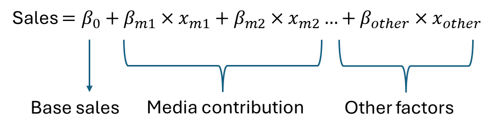
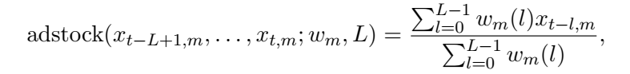
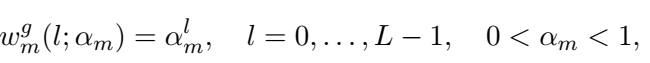
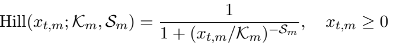
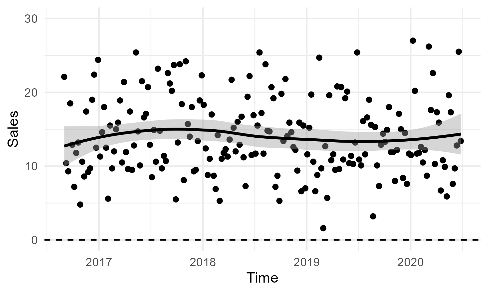
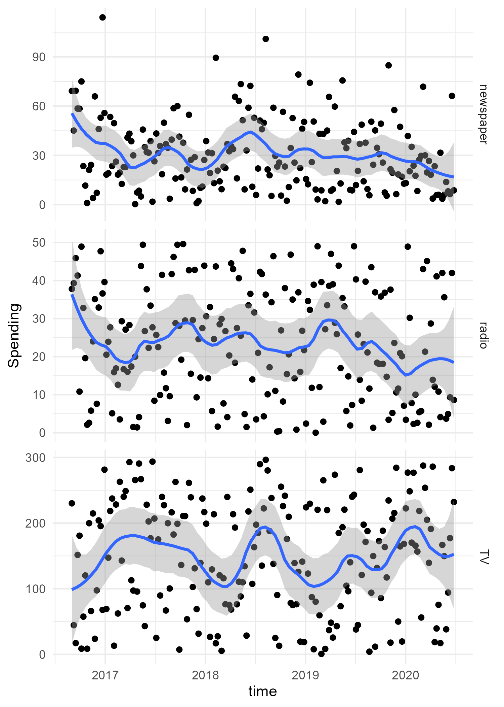
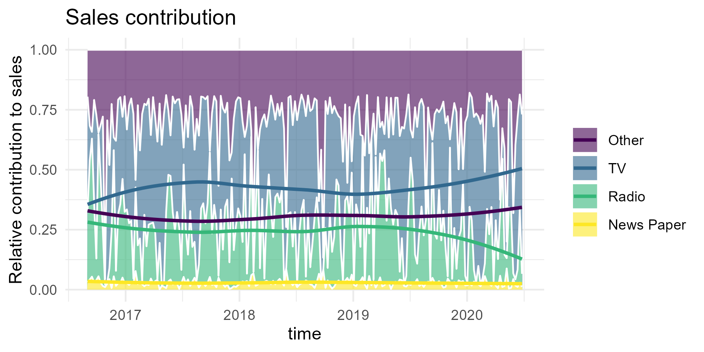
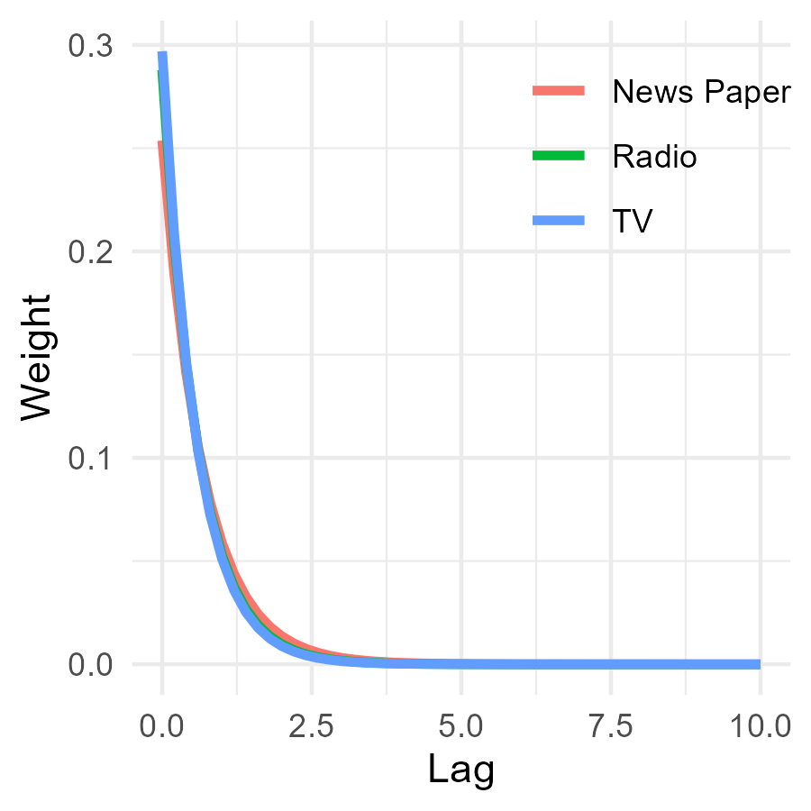
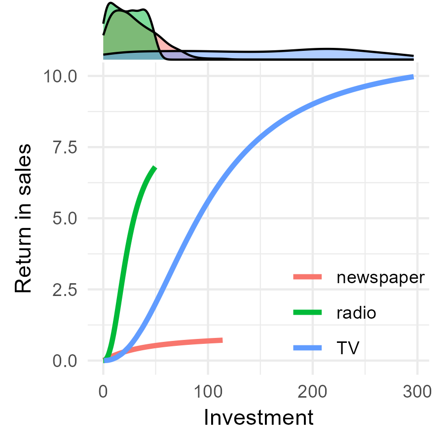
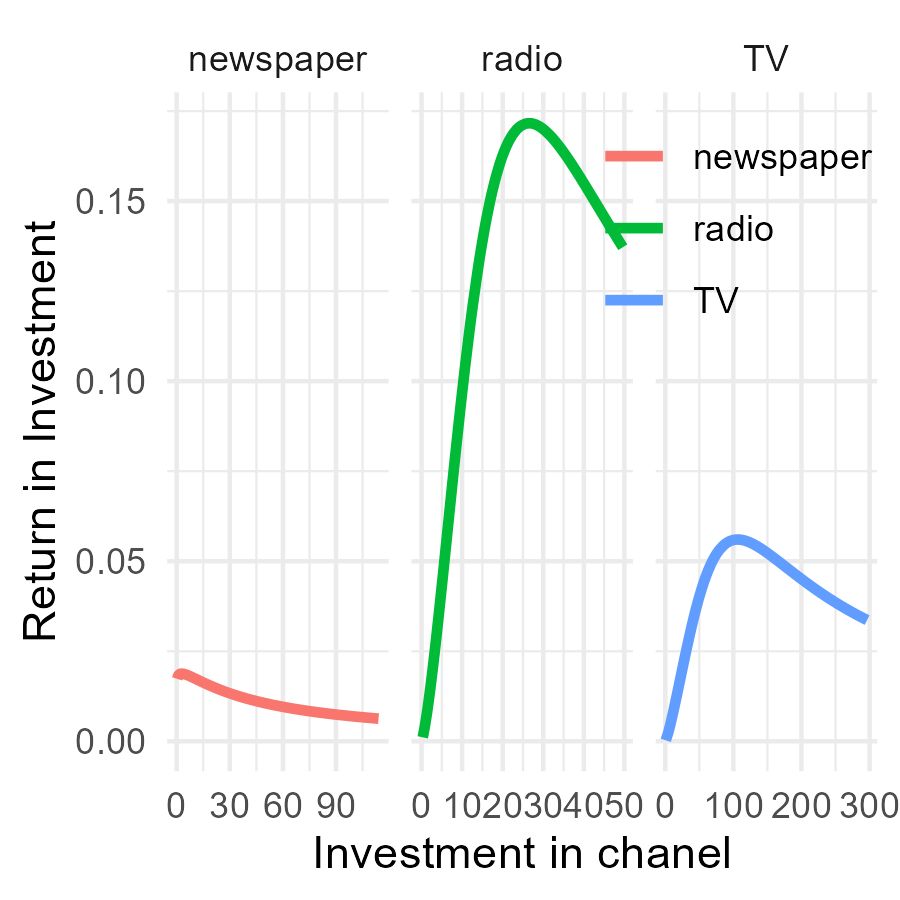

# Using RStan for a Bayesian Approach to Media Mix Modeling with Carryover and Shape Effects

This project is inspired by the model descriptions provided by Jin et al., 2017. It is implemented in R but can be easily adapted to Python.

## Project Overview

In this project, I will:
1. Demonstrate how to fit a Bayesian Media Mix Model (MMM) to estimate channel contributions to sales, incorporating Carryover and Shape Effects.
2. Show how to calculate important Key Performance Indicators (KPIs).
3. Discuss the results and investment optimization strategies.

## Introduction

Marketing Mix Modeling, or Media Mix Modeling (MMM), is used by advertisers to measure how their media spending contributes to sales. In the classical framework, media contributions are estimated via a linear regression approach, where the beta estimates of the media channels describe their contribution:



## Addstock

More sophisticated models assume that the effect of media spending is not immediate but can lag. For example, a TV advertisement broadcasted a few weeks ago could still positively influence sales today. This Carryover effect in advertising is modeled via an adstock function:



with *w* being a weight for different lags *l*.

The weights (*w*) are described by a decay function. The lower the decay parameter &alpha;, the longer the effect of an advertisement lasts:



## Diminishing Returns

Another important assumption is that media spending does not necessarily increase sales linearly. At some point, each additional dollar spent will have less effect. This is described by a Hill function:



with the parameter *K* describing the half-saturation point and *S* describing the slope.

## Model

The final model has the following parameters:

| Parameter            | Description                                                   | Variable name in model |
|----------------------|---------------------------------------------------------------|------------------------|
| Intercept            | Base sales                                                    | *intercept*            |
| Control betas        | Control variables accounting for other factors such as seasonality | *beta_ctrl*            |
| Media betas          | Scaling the influence of the media                            | *beta_media*           |
| Half-saturation point| Describing the investment when half the maximal influence is reached | *ec*                   |
| Slope                | Describing the shape of the Hill function                     | *slope*                |

## Data

I explored the data posted on this Git repository. It describes weekly sales over approximately 4 years with investments in TV, newspaper, and radio:



with most spending being on TV:



We can now model the effect of media spending on sales with our model written in Stan:

```stan
functions {
  // the Hill function
  real Hill(real t, real ec, real slope) {
    return 1 / (1 + (t / ec)^(-slope));
  }
  // the adstock transformation with a vector of weights
  real Adstock(vector t, row_vector weights) {
    return dot_product(t, weights) / sum(weights);
  }
}

data {
  int<lower=1> N;
  real y[N]; // the vector of sales
  int<lower=1> max_lag; // the maximum duration of lag effect, in weeks
  int<lower=1> num_media; // the number of media channels
  matrix[N + max_lag -1, num_media] X_media; // matrix of media variables
  int<lower=1> num_ctrl; // the number of other control variables
  matrix[N, num_ctrl] X_ctrl; // a matrix of control variables
}

parameters {
  real<lower=0> noise_var; // residual variance
  real intercept; // the intercept
  vector[num_media] beta_media; // the coefficients for media variables
  vector[num_ctrl] beta_ctrl; // the coefficients for control variables
  vector<lower=0,upper=1>[num_media] decay; // the decay parameter for adstock
  vector<lower=0>[num_media] ec; // hill
  vector<lower=0>[num_media] slope;
}

transformed parameters {
  real cum_effect;
  row_vector[max_lag] lag_weights;
  matrix[N, num_media] cum_effects_hill;
  real mu[N];
  for (nn in 1:N) {
    for (media in 1:num_media) {
      for (lag in 1:max_lag) {
        lag_weights[lag] <- pow(decay[media], (lag) ^ 2);
      }
      cum_effect <- Adstock(sub_col(X_media, nn, media, max_lag), lag_weights);
      cum_effects_hill[nn, media] <- Hill(cum_effect, ec[media], slope[media]);
    }
    mu[nn] <- intercept + dot_product(cum_effects_hill[nn], beta_media) +
    dot_product(X_ctrl[nn], beta_ctrl);
  } 
}

model {
  decay ~ beta(3,10);
  intercept ~ normal(0, 5);
  beta_media ~ normal(0, 1);
  beta_ctrl ~ normal(0, 1);
  noise_var ~ inv_gamma(0.05, 0.05 * 0.01);
  slope ~ normal(1,0.3);
  ec ~ gamma(4, 0.1);
  y ~ normal(mu, sqrt(noise_var));
}

generated quantities {
  real cum_effect2;
  row_vector[max_lag] lag_weights2;
  matrix[N, num_media] cum_effects_hill2;
  matrix[N, num_media] media_contr;
  real tot[N];
  real contr[N];
  
  for (nn in 1:N) {
    for (media in 1:num_media) {
      for (lag in 1:max_lag) {
        lag_weights2[lag] <- pow(decay[media], (lag) ^ 2);
      }
      cum_effect2 <- Adstock(sub_col(X_media, nn, media, max_lag), lag_weights2);
      cum_effects_hill2[nn, media] <- Hill(cum_effect2, ec[media], slope[media]);
    }
    tot[nn] <- intercept + dot_product(cum_effects_hill2[nn], beta_media) +
    dot_product(X_ctrl[nn], beta_ctrl);
    contr[nn] <- intercept + dot_product(X_ctrl[nn], beta_ctrl);
    media_contr[nn, 1] <- intercept + dot_product([0, cum_effects_hill2[nn,2],cum_effects_hill2[nn,3]], beta_media) +
    dot_product(X_ctrl[nn], beta_ctrl);
    media_contr[nn, 2] <- intercept + dot_product([cum_effects_hill2[nn,1],0,cum_effects_hill2[nn,3]], beta_media) +
    dot_product(X_ctrl[nn], beta_ctrl);
    media_contr[nn, 3] <- intercept + dot_product([cum_effects_hill2[nn,1],cum_effects_hill2[nn,2],0], beta_media) +
    dot_product(X_ctrl[nn], beta_ctrl);
  } 
}
```

## Results

### Sales Contribution

1. About 30% of the sales cannot be attributed to media spending.
2. TV has the highest contribution to sales, averaging about 40%.
3. Radio and newspaper have less contribution, with newspaper contributing only a few percent.



### Carry-over Effect

The effect of media decays very fast:



### Hill Function

While the effect of newspaper spending on sales saturates quickly, sales continue to increase with higher spending on TV and radio.



### Return on Investment

Radio clearly has the highest rate of return, suggesting that increasing investment in radio may be beneficial. On the other hand, ROI in newspapers is very low and probably not worth it.



### Why Bayesian?

This project demonstrates the use of mixed marketing models to analyze the relationship between marketing channel spends and sales outcomes using a Bayesian framework.

The benefits of Bayesian frameworks include:
1. Allowing the incorporation of prior knowledge via priors.
2. Building custom models using PyMC or Stan.
3. Enabling the formulation of generative models.
4. Providing better uncertainty quantification in model parameters and forecasts.

### Prerequisites

- R and RStudio installed on your machine.
- Required R packages: `datarium`, `tidyr`, `PerformanceAnalytics`, `ggplot2`, `rstan`, `dplyr`, and others.

Check out the HTML file `NNN_Stan2` for the code and `Market_mix_modeling.Rmd` for a analysis with BRMS.
