# Using RStan for a Bayesian Approach to Media Mix Modeling with Carryover and Shape Effects

This project is inspired by the model descriptions provided by Jin et al., 2017. It is implemented in R but can be easily adapted to Python. 
**Note:** This is a work in progress and an exploratory project for learning purposes. Several steps of a rigorous Bayesian workflow are simplified or omitted intentionally.

## Project Overview

In this project, I will:
1. Demonstrate how to fit a Bayesian Media Mix Model (MMM) to estimate channel contributions to sales, incorporating Carryover (adstock) and Shape Effects.
2. Show how to calculate important Key Performance Indicators (KPIs).
3. Discuss the results and investment optimization strategies.

## Code

Find the code here:`Stan_analysis.R`

## Introduction

Marketing Mix Modeling, or Media Mix Modeling (MMM), is used by advertisers to measure how their media spending contributes to sales. In the classical framework, media contributions are estimated via a linear regression approach, where the beta estimates of the media channels describe their contribution:

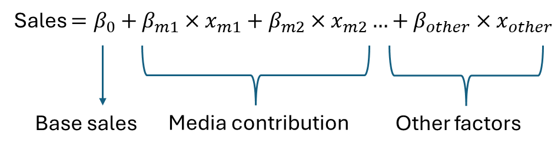

## Adstock

More sophisticated models assume that the effect of media spending is not immediate but can lag. For example, a TV advertisement broadcasted a few weeks ago could still positively influence sales today. This Carryover effect in advertising is modeled via an adstock function:

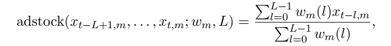

with *w* being a weight for different lags *l*.

The weights (*w*) are described by a decay function. The lower the decay parameter &alpha;, the longer the effect of an advertisement lasts:

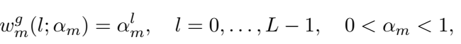

## Diminishing Returns

Another important assumption is that media spending does not necessarily increase sales linearly. At some point, each additional dollar spent will have less effect. This is described by a Hill function:

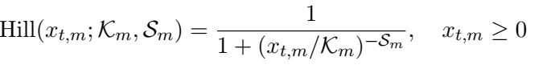

with the parameter *K* describing the half-saturation point and *S* describing the slope.

## Model

The final model has the following parameters:

| Parameter            | Description                                                   | Variable name in model |
|----------------------|---------------------------------------------------------------|------------------------|
| Intercept            | Base sales                                                    | *intercept*            |
| Control betas        | Control variables accounting for other factors such as seasonality | *beta_ctrl*            |
| Media betas          | Scaling the influence of the media                            | *beta_media*           |
| Half-saturation point| Describing the investment when half the maximal influence is reached | *ec*                   |
| Slope                | Describing the shape of the Hill function                     | *slope*                |

## Data

I explored data from a Kaggle repository as a toy example. It describes weekly sales over approximately 4 years with investments in TV, newspaper, and radio:

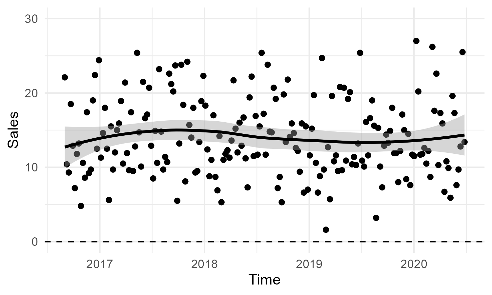

with most spending being on TV:

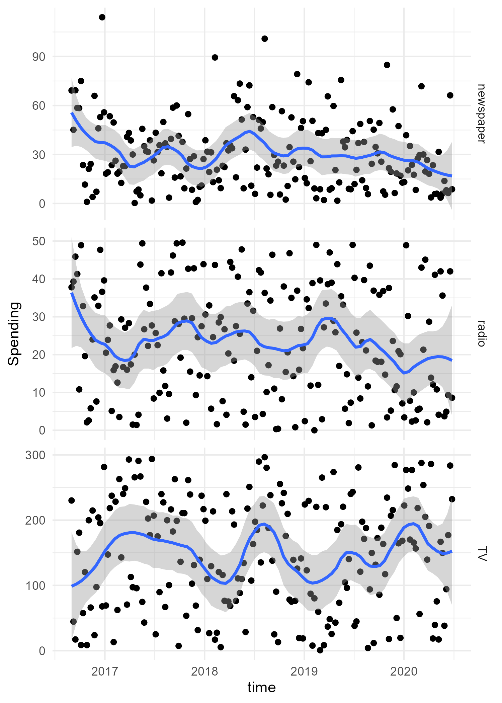

We can now model the effect of media spending on sales with our model written in Stan:

```stan
functions {
  // Hill function for diminishing returns
  real Hill(real t, real ec, real slope) {
    return 1 / (1 + (t / ec)^(-slope));
  }
  // Adstock transformation for carryover effects
  real Adstock(vector t, row_vector weights) {
    return dot_product(t, weights) / sum(weights);
  }
}

data {
  int<lower=1> N; // Number of observations
  real y[N]; // Sales vector
  int<lower=1> max_lag; // Maximum lag duration
  int<lower=1> num_media; // Number of media channels
  matrix[N + max_lag -1, num_media] X_media; // Media variables matrix
  int<lower=1> num_ctrl; // Number of control variables
  matrix[N, num_ctrl] X_ctrl; // Control variables matrix
}

parameters {
  real<lower=0> sigma; // Residual variance
  real intercept; // Intercept
  vector[num_media] beta_media; // Coefficients for media variables
  vector[num_ctrl] beta_ctrl; // Coefficients for control variables
  vector<lower=0,upper=1>[num_media] decay; // Decay parameter for adstock
  vector<lower=0>[num_media] ec; // Hill function parameter
  vector<lower=0>[num_media] slope; // Hill function slope
}

transformed parameters {
  real cum_effect; // Cumulative media effect
  row_vector[max_lag] lag_weights; // Lag weights
  matrix[N, num_media] cum_effects_hill; // Cumulative effects after Hill transformation
  real mu[N]; // Predicted sales

  for (nn in 1:N) {
    for (media in 1:num_media) {
      for (lag in 1:max_lag) {
        lag_weights[lag] <- pow(decay[media], (lag) ^ 2);
      }
      cum_effect <- Adstock(sub_col(X_media, nn, media, max_lag), lag_weights);
      cum_effects_hill[nn, media] <- Hill(cum_effect, ec[media], slope[media]);
    }
    mu[nn] <- intercept + dot_product(cum_effects_hill[nn], beta_media) + dot_product(X_ctrl[nn], beta_ctrl);
  }
}

model {
  decay ~ beta(3,10);
  intercept ~ normal(0, 5);
  beta_media ~ normal(0, 5);
  beta_ctrl ~ normal(0, 5);
  sigma ~ normal(0, 5);
  slope ~ normal(1,5);
  ec ~ gamma(4, 0.05);
  y ~ normal(mu, sigma);
}

generated quantities {
  array[N] real y_rep;

  // Log-likelihood for LOO-CV model comparison
  vector[N] log_lik;
  
  vector[N] tot;        
  vector[N] base_contr; 
  matrix[N, num_media] media_contr; 
  for (nn in 1:N) {

     tot[nn] = intercept 
              + dot_product(cum_effects_hill[nn], beta_media) 
              + dot_product(X_ctrl[nn], beta_ctrl);

      base_contr[nn] = intercept + dot_product(X_ctrl[nn], beta_ctrl);

    for (media in 1:num_media) {
      vector[num_media] effects_without;
      effects_without = cum_effects_hill[nn]';  
      effects_without[media] = 0;            
      
      media_contr[nn, media] = intercept 
                               + dot_product(effects_without, beta_media) 
                               + dot_product(X_ctrl[nn], beta_ctrl);
    }

    // Posterior predictives
    y_rep[nn] = normal_rng(tot[nn], sigma);

    // likelihood
    log_lik[nn] = normal_lpdf(y[nn] | tot[nn], sigma);
  }
}
```

## Results

### Posterior Predictive Checks

The model recovers overall mean sales and variance reasonably well but 
systematically over-estimates extreme values. This likely 
reflects model misspecification — possible causes include missing 
seasonality terms or a non-normal likelihood. This is left as is for 
this exploratory project.


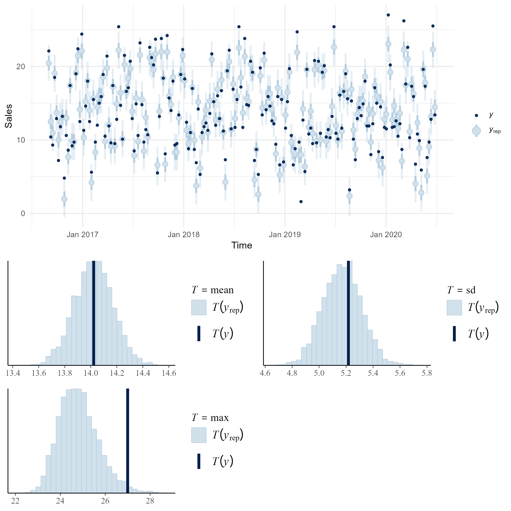


### Sales Contribution

1. About 30% of the sales cannot be attributed to media spending.
2. TV has the highest contribution to sales, averaging about 40%.
3. Radio and newspaper have less contribution, with newspaper contributing only a few percent.

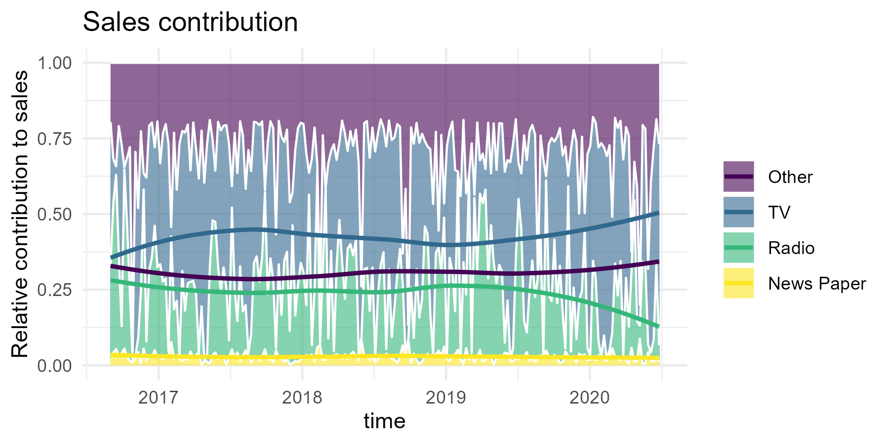

### Carry-over Effect

The effect of media decays very fast:

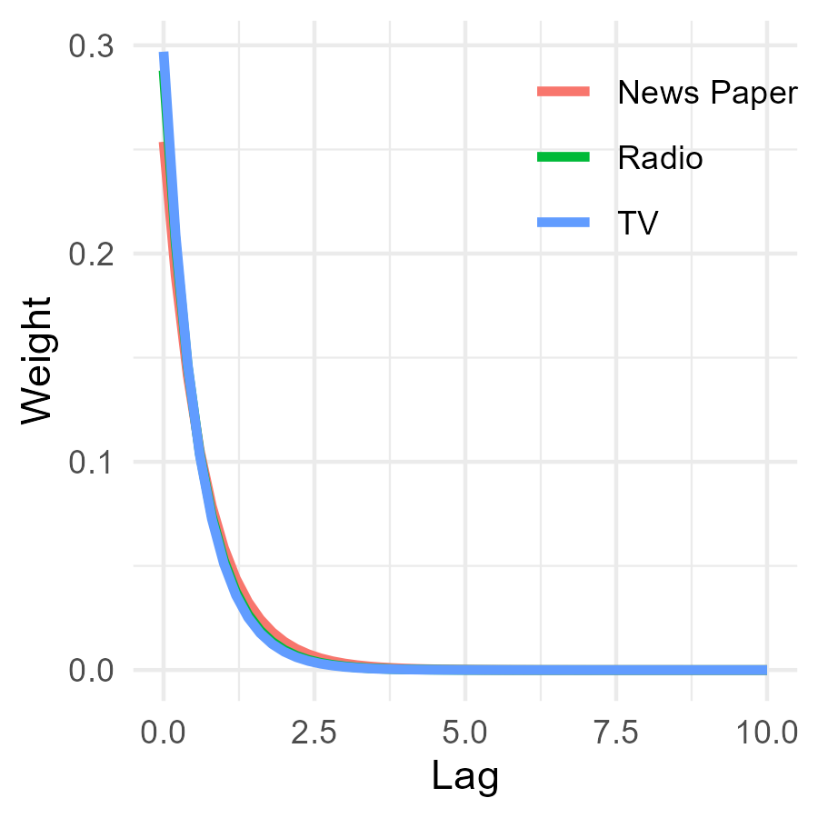

### Hill Function

While the effect of newspaper spending on sales saturates quickly, sales continue to increase with higher spending on TV and radio.

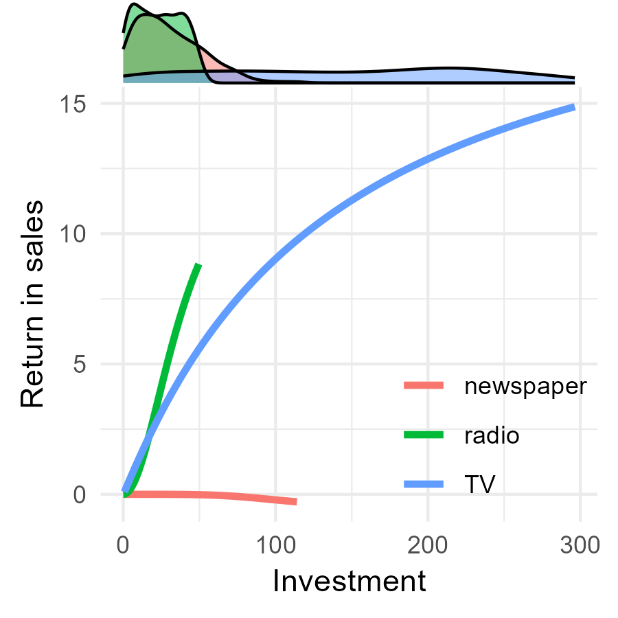

### Return on Investment

Radio clearly has the highest rate of return, suggesting that increasing investment in radio may be beneficial. 

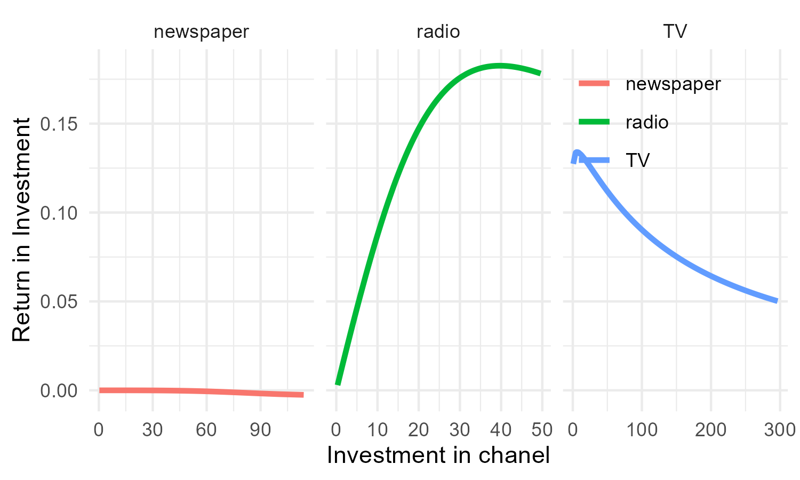

### Optimization 

To identify the optimal investment allocation, I used the `optim` function 
in R with a BFGS algorithm, starting from multiple random initializations 
to avoid local optima. Budget allocations were enforced to sum to the 
historical total via a softmax transformation, and expected incremental 
sales were computed across 250 posterior samples. The analysis suggests 
that maximizing sales is achieved with approximately 36% allocated to TV, 
64% to radio, and minimal or no investment in newspaper.

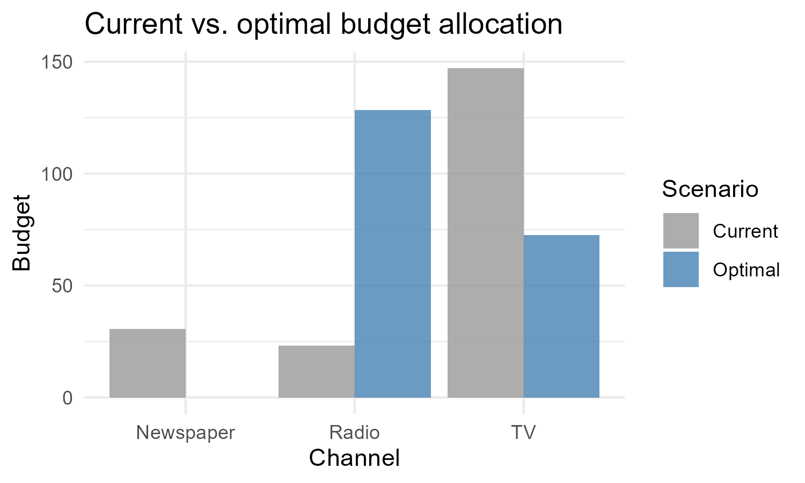

We predict the optimal allocation will, with a 92% probability, lead to an increase in sales by at least 10.  

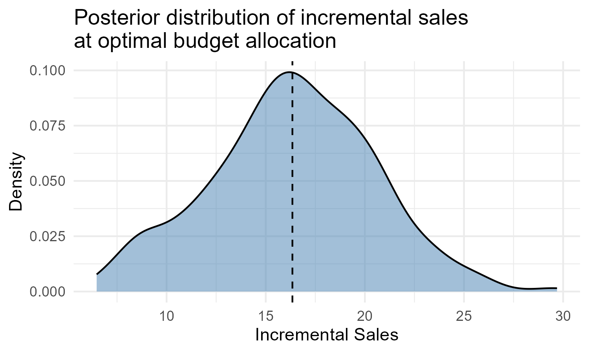


### Why Bayesian?

This project demonstrates the use of mixed marketing models to analyze the relationship between marketing channel spends and sales outcomes using a Bayesian framework. I actually skipped quite some important steps in the Bayesian Workflow for simplicity. 

The benefits of Bayesian frameworks include:
1. Allowing the incorporation of prior knowledge via priors.
2. Building custom models using PyMC or Stan.
3. Enabling the formulation of generative models.
4. Providing better uncertainty quantification in model parameters and forecasts.

### Prerequisites

- R and RStudio installed on your machine.
- Required R packages: `lubridate`, `tidyr`, `cowplot`, `ggplot2`, `rstan`, `dplyr`.

