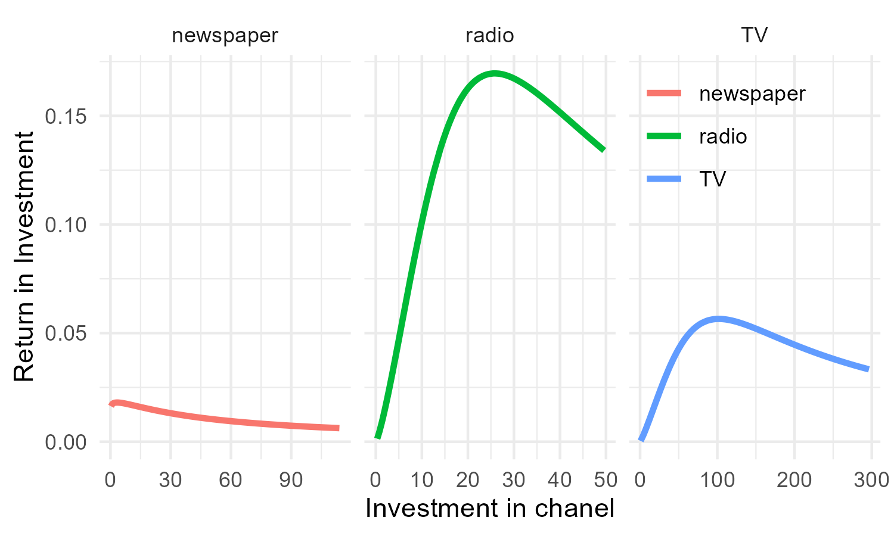

# Using RStan for a Bayesian Approach for Media Mix Modeling with Carryover and Shape Effects

This project is influenced by the model descriptions provided by Jin et al., 2017 (link). This project is implemented in R but could be implemented easily in Python. 

## Project Overview

In this project I will:
1. Show  how to fit a Bayesain MMM model to estimate chanel contributions to sales with Carryover and Shape Effects.
2. Show how to calculate important KPIs.
3. Discuss the results and investment optimization. 


## Introduction

Marketing Mix Model, or Media Mix Model (MMM) is used by advertisers to measure how their media spending contributes to sales. In the classical framework media contributions are estimated via a linear regression approeach, whereby the beta estimates of the media chanels describe their contribution: 


## Addstock

More sofisticated models assume that the the effect of media spendings is not only emidiate but can lag behing. For example, a TV advertisement breadcasted a few weeks ago could still have a positive influece on sales today. This Caryover effect in advertisign is modeled via an adstock function:

with *w* being a weight for different lags *l*. 


The weights (*w*) are described by a decay function. The lower the decay parameter &alpha;, the longer is the effect of an advertisment lasting:   


## Diminushing Returns

Another important assumption is that media spending do not necsesarily increase the sales linearly. At some point, each additional dollar spend will have less of an effect. This is described by a Hill-function. 


with the paramter *K*, describing the half saturation point and *S*, describing the slope.

# Model

The final model has follwoing paramters:


| Parameter |  Description |Variable name in model|
|----------|----------|----------|
| intercept |  Base sales | *intercept*
| Control betas |  Control variables accounting for other factors such as seasonality |  *beta_ctrl*|
| Media betas |  Scaling the influence of the media  | *beta_media*|
| Half-saturation point |  DEscribing the investment when half the maximal infleuce is reached  | *ec*|
| Slope |  Describign the shape of the Hill function  | *slope*|

# Data

I explored the data posted on this git repository. 
It is data describing weekly sales over approximatly 4 years with investments into TV, newspaper and radio:


with most of spending being into TV:


Anyway, we can now model the effect of media spending on sales with our model written in stan:

```
functions {
  // the Hill function
  real Hill(real t, real ec, real slope) {
    return 1 / (1 + (t / ec)^(-slope));
  }
  // the adstock transformation with a vector of weights
  real Adstock(vector t, row_vector weights) {
    return dot_product(t, weights) / sum(weights);
  }
}

data {
  
  int<lower=1> N;
  
  real y[N]; // the vector of sales
  
  // the maximum duration of lag effect, in weeks
  int<lower=1> max_lag;
  
  // the number of media channels
  int<lower=1> num_media;
  
  // matrix of media variables
  matrix[N + max_lag -1, num_media] X_media;
  

  // the number of other control variables
  int<lower=1> num_ctrl;
  
  // a matrix of control variables
  matrix[N, num_ctrl] X_ctrl;
}

parameters {
  // residual variance
  real<lower=0> noise_var;
  
  // the intercept
  real intercept;
  
  // the coefficients for media variables and base sales
  vector[num_media] beta_media;
  vector[num_ctrl] beta_ctrl;
  
  // the decay  parameter for the adstock transformation of
  // each media
  vector<lower=0,upper=1>[num_media] decay;
  
  // hill
  vector<lower=0>[num_media] ec;
  vector<lower=0>[num_media] slope;

}

transformed parameters {
  // the cumulative media effect after adstock
  real cum_effect;
  

  // adstock, mean-center, log1p transformation
  row_vector[max_lag] lag_weights;
  
  //hill
  matrix[N, num_media] cum_effects_hill;
  
  real mu[N];
  for (nn in 1:N) {
    for (media in 1 : num_media) {
      for (lag in 1 : max_lag) {
        lag_weights[lag] <- pow(decay[media], (lag) ^ 2);
      }
      cum_effect <- Adstock(sub_col(X_media, nn, media, max_lag), lag_weights);
      cum_effects_hill[nn, media] <- Hill(cum_effect, ec[media], slope[media]);

    }
    mu[nn] <- intercept + dot_product(cum_effects_hill[nn], beta_media) +
    dot_product(X_ctrl[nn], beta_ctrl);
  } 
}
model {
  decay ~ beta(3,10);
  intercept ~ normal(0, 5);
  beta_media ~ normal(0, 1);
  beta_ctrl ~ normal(0, 1);
  noise_var ~ inv_gamma(0.05, 0.05 * 0.01);
  

  // hill
  slope ~ normal(1,0.3);
  ec ~ gamma(4, 0.1);
  y ~ normal(mu, sqrt(noise_var));
}

generated quantities {
  // for calculating the marginal effects
  real cum_effect2;
  row_vector[max_lag] lag_weights2;
  matrix[N, num_media] cum_effects_hill2;
  matrix[N, num_media] media_contr;
  real tot[N];
  real contr[N];
  
  for (nn in 1:N) {
    for (media in 1 : num_media) {
      for (lag in 1 : max_lag) {
        lag_weights2[lag] <- pow(decay[media], (lag) ^ 2);
      }
      cum_effect2 <- Adstock(sub_col(X_media, nn, media, max_lag), lag_weights2);
      cum_effects_hill2[nn, media] <- Hill(cum_effect2, ec[media], slope[media]);

    }
    // predicted sales
    tot[nn] <- intercept + dot_product(cum_effects_hill2[nn], beta_media) +
    dot_product(X_ctrl[nn], beta_ctrl);
    
    // predicted sales without media
    contr[nn] <- intercept +
    dot_product(X_ctrl[nn], beta_ctrl);
    
    // predicted sales without first media
    media_contr[nn, 1] <- intercept + dot_product([0, cum_effects_hill2[nn,2],cum_effects_hill2[nn,3]], beta_media) +
    dot_product(X_ctrl[nn], beta_ctrl);
    
    // predicted sales without second media
    media_contr[nn, 2] <- intercept + dot_product([cum_effects_hill2[nn,1],0,cum_effects_hill2[nn,3]], beta_media) +
    dot_product(X_ctrl[nn], beta_ctrl);
    
    // predicted sales without third media
    media_contr[nn, 3] <- intercept + dot_product([ cum_effects_hill2[nn,1],cum_effects_hill2[nn,2],0], beta_media) +
    dot_product(X_ctrl[nn], beta_ctrl);
    

  } 

}
```

# Results
Let's shortly disucuss the results. 

### Sales contribution

1.  About 30% if the sales cannot be attributed to media spendings.
2. TV has the highest contribution to sales with on average about 40%.
3. Radio and newspaper have less contribution on sales with newspaper only contributing a few percent.


### Carry-over effect

The effect of media decays very fast:


### Hill function

While the effect of  newspaper spendings on sales saturate very fast, the sales keep increasing  for higher spendings in TV and radio. 


### Return of investment

Radio has clearly the highest rate of return. Thus, I might pay of to increase investment in radio. On the other hand, ROI in newspaper is very low and probably not worth it.




### Why Bayesian-

This project demonstrates the use of mixed marketing models to analyze the relationship between marketing channel spends and sales outcomes using a Bayesian framework.

The benefits of Baysian Frameworks is:
1. Allowing to add prior knowledge via priors.
2. Build costumn models using PyMC or Stan.
3. Related allows to formulize the generative model.
4. Allows better uncertainty qunatization in model parameters and forecasts.

   ### Prerequisites

- R and RStudio installed on your machine.
- Required R packages: `datarium`, `tidyr`, `PerformanceAnalytics`, `ggplot2`, `rstan`, `dplyr`, and some smaller other.

Check out the html file `Market_mix_modeling.html` for the results and `Market_mix_modeling.Rmd` for the code. 
